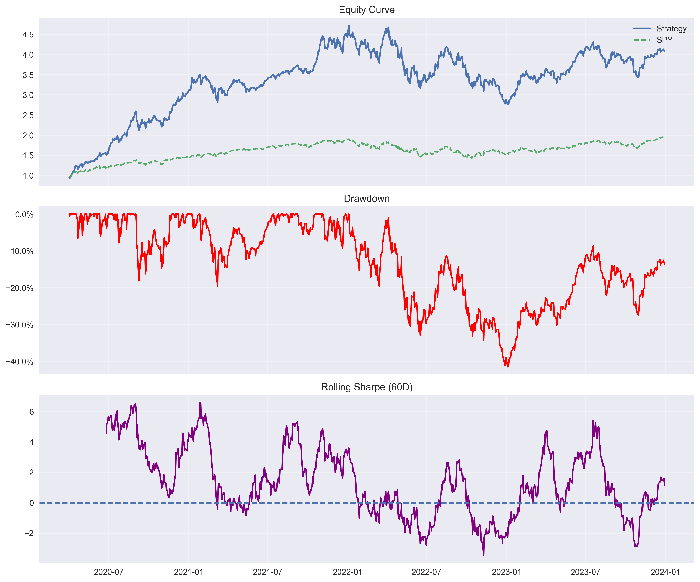

# 📊 Regime-Adaptive Portfolio Optimization System


## Overview

This project implements a full quantitative research pipeline for portfolio construction, incorporating:

- Mean-variance optimization (SciPy)
- Walk-forward out-of-sample validation
- Transaction cost modeling
- Market regime detection (bull vs bear)
- Factor exposure analysis (alpha & beta decomposition)
- Rolling stability diagnostics

The system is designed to simulate how institutional portfolio strategies are researched, tested, and validated under realistic market conditions.

---
## 📊 Performance Dashboard



## 🧠 Key Features

### 1. Portfolio Optimization
- Constrained mean-variance optimization
- Maximum position sizing (risk control)
- Diversification constraints

### 2. Market Regime Detection
- Bull vs bear classification using moving average trend signals
- Adaptive strategy behavior based on regime

### 3. Walk-Forward Backtesting
- Rolling train/test framework
- Fully out-of-sample evaluation
- Realistic execution simulation

### 4. Transaction Cost Modeling
- Turnover-based cost deduction
- Rebalancing-aware simulation

### 5. Factor Analysis
- Alpha / Beta decomposition vs market (SPY)
- Rolling regression for time-varying exposure

### 6. Stability Analysis
- Coefficient of variation for alpha and beta
- Strategy robustness scoring

---

## 📊 Methodology

The portfolio is constructed using rolling window optimization:

1. Historical returns are computed from asset price data
2. Covariance and expected returns are estimated over a rolling window
3. Portfolio weights are optimized using SciPy (SLSQP solver)
4. Regime detection adjusts the objective function dynamically
5. Out-of-sample performance is evaluated using walk-forward testing

---

## 📈 Key Outputs

- Equity curve (strategy vs benchmark)
- Rolling alpha and beta exposure
- Regime-based performance breakdown
- Stability score (strategy robustness)
- Max drawdown and Sharpe ratio

---

## 🧪 Example Results

*(Add your plots here later from /reports/figures)*

- Portfolio vs SPY equity curve
- Rolling beta over time
- Alpha stability visualization
- Drawdown comparison

---

## 💡 Why This Project Matters

This project goes beyond basic backtesting by incorporating:

- Out-of-sample walk-forward validation
- Transaction cost modeling
- Regime-aware portfolio allocation
- Factor-based performance attribution
- Stability and robustness diagnostics

These are critical components of real-world quantitative research pipelines used in institutional asset management.

## 🛠 Tech Stack

- Python
- NumPy / Pandas
- SciPy (optimization)
- Statsmodels (factor regression)
- Matplotlib (visualization)

---

## 📌 Key Insights

- Strategy performance is regime-dependent
- Transaction costs significantly impact returns at high turnover
- Beta exposure is time-varying, not static
- Stability metrics reveal whether alpha is persistent or noise

---

## 🚀 Future Improvements

- Multi-factor models (momentum, value, volatility)
- Reinforcement learning-based allocation
- Risk parity extensions
- Real-time data pipeline integration

---

## 📁 How to Run

```bash
pip install -r requirements.txt
python notebooks/09_walk_forward.ipynb